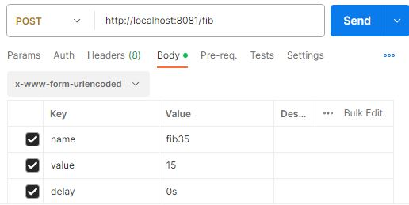

## Some go stuff and miny projects

> [!WARNING]  
> When running a Go file in your terminal, you may encounter antivirus alerts. This is typically due to the nature of Go's compilation process, which involves the creation of standalone executables.


### Miny projects
This repository contains a set of simple projects made while learning go
- Recursive Fibonnaci implementation
- site open ports scanner
- go chat


### GO CHAT
A simple Go Chat application. It uses the net package to create an HTTP server that listens for connections on a default port: 3090

In order to test this project you need to build the `netcat.go` and `chat.go` file in the `Avanzado` folder

Build files:
```bash
go build Avanzado/net/netcat.go
```

```bash
go build Avanzado/net/netcat.go
```

run the .exe files:

 `first` chat.exe file 
```bash
./Avanzado/chat
```
`second` netcat.exe file, on another terminal window(this would be the client)
```bash
./Avanzado/netcat
```

<p align="center">

</p>

### PORT SCANNER
Script that scans open ports of a remote server

there's no need to build this one

to run:
```bash
go run Avanzado/net/port.go --site= domain or server ip
```

test domain
```bash
go run Avanzado/net/port.go --site=scanme.webscantest.com
```
<p align="center">

</p>

### WORKER POOL WITH FIBONACCI CALCULATION
Implements a "worker pool" pattern to calculate numbers from the Fibonacci sequence concurrently. It also includes a simple HTTP server that accepts POST requests to calculate Fibonacci with specific delays. Below is an overview of the script and how to run it.

To run:
```bash
go run Intermedio/project/main.go
```

Send a post request with the number to the following endpoint
    
    http://localhost:8081/fib

The post request needs a name a value and a request:

<p align="center">

</p>

The result will apaer in the treminal where you run the script:

<p align="center">

</p>